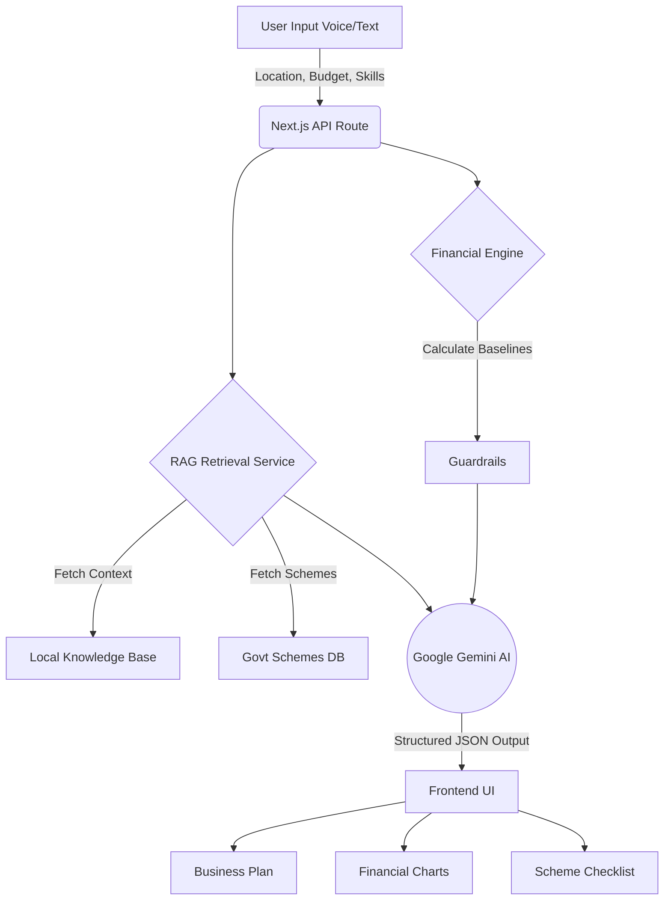

# AI-Driven Hyper-Local Business Advisory and Financial Structuring Assistant

**Smart India Hackathon 2026 (SIH 2026)**
**Problem ID:** SIH26091

## Team Members
- **Karan P**
- **Kiruthika M**
- **Lakshya R**
- **Mamathi S**
*(Hindustan Institute of Technology & Science)*

---

## 🚀 Project Overview

Rural micro-entrepreneurs face massive hurdles in building sustainable businesses due to language barriers, low digital literacy, and lack of hyper-local market insights. 

**Unnati Advisor** is an AI-driven, voice-enabled web platform designed to solve this. It provides personalized, hyper-local business plans, automated financial projections, and perfectly matched government scheme recommendations (PMEGP, MUDRA) tailored to a user's exact village, budget, and skillset.

### 🌟 Key Features

1. **Voice-Enabled Sequential Chatbot**: Overcomes low literacy by allowing users to dictate their location, budget, and skills using native Speech-to-Text.
2. **Multilingual AI Responses**: Select between English, Hindi, and Tamil. The prompt natively forces the Gemini LLM to return fully translated, structured JSON output.
3. **RAG-Grounded Scheme Advisory**: Our Retrieval-Augmented Generation (RAG) module grounds the AI in verified government scheme policies and hyper-local district templates.
4. **Interactive Financial Breakdown**: A visual dashboard (using `Recharts`) that automatically projects 6-month revenues, initial investments, and break-even points.
5. **Production Resilience & PWA**: Caches static assets via a Service Worker (`sw.js`) and persists session state via `localStorage`. Gracefully falls back to a pre-computed plan if network/API drops, ensuring 100% demo uptime.
6. **One-Click Export**: Easily download the comprehensive business plan as a PDF for offline reference.

---

## 🏗️ Architecture Flow



---

## 💻 Quickstart Guide

### Prerequisites
- Node.js (v18+)
- Google Gemini API Key

### Local Setup

1. **Clone the repository:**
   ```bash
   git clone https://github.com/your-org/unnati-advisor.git
   cd unnati-advisor
   ```

2. **Install Dependencies:**
   ```bash
   npm install
   ```

3. **Set Environment Variables:**
   Copy the example environment file and insert your Gemini API Key.
   ```bash
   cp .env.example .env.local
   ```
   *Edit `.env.local`:*
   ```env
   GEMINI_API_KEY=your_gemini_api_key_here
   ```

4. **Run the Development Server:**
   ```bash
   npm run dev
   ```
5. **Open the App:** Navigate to `http://localhost:3000` in your browser.

---

## 🛠️ Tech Stack
- **Frontend Framework:** Next.js 14 (App Router), React
- **Styling:** Tailwind CSS
- **AI/LLM:** Vercel AI SDK, Google Gemini (`gemini-1.5-pro`)
- **Data Visualization:** Recharts
- **Icons:** Lucide React
- **Deployment Ready:** Vercel (Optimized for edge networking)
